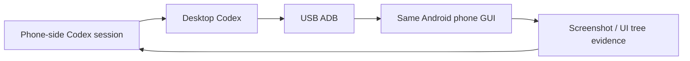
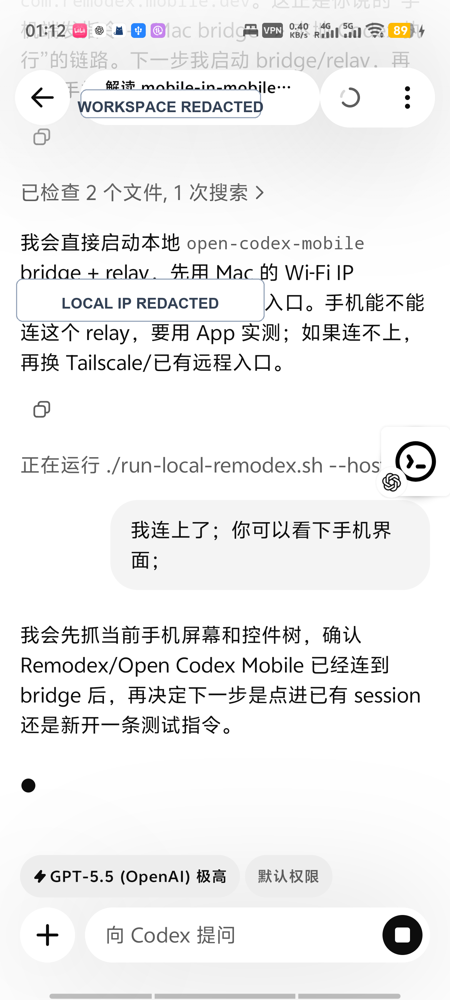
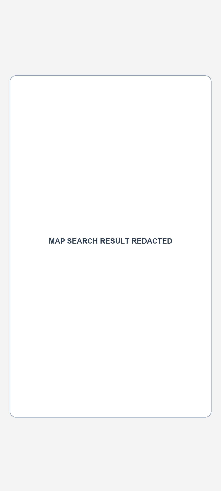
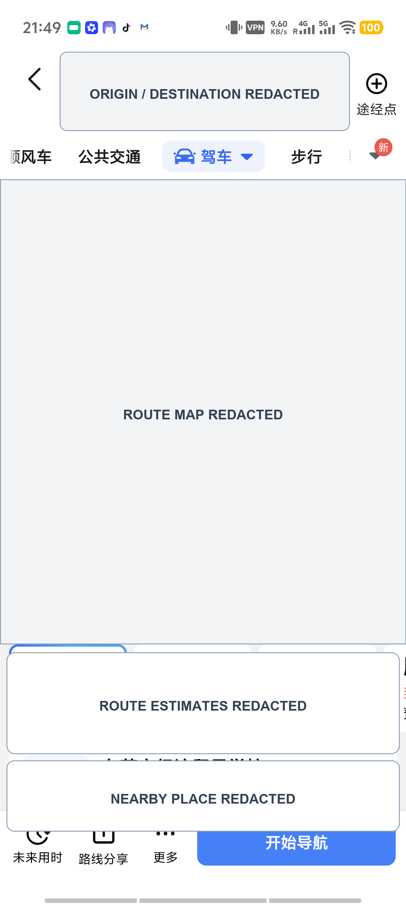
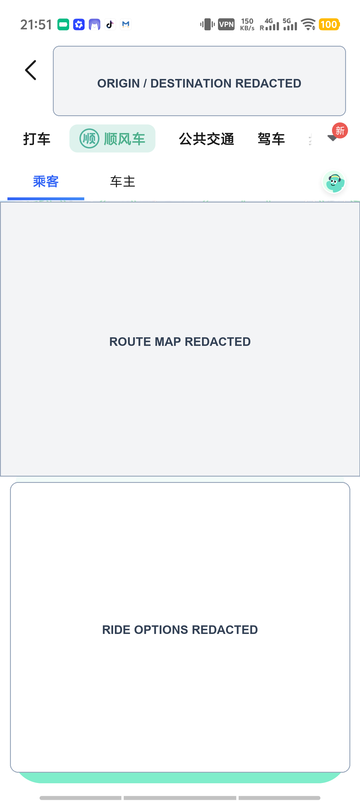

# Mobile-on-Mobile Agent Loop

> A phone-side Codex session asks desktop Codex to operate the same phone through ADB.

This is an Open Codex Labs experiment, not a core Open Codex Mobile app feature. The demo uses a phone-side Codex session as the controller, desktop Codex as the executor, and USB ADB as the phone GUI control bridge.

## Why this matters

The phone is usually treated as a remote control for an agent. This experiment turns the same phone into both the controller and the target:

- Controller: the user sends a task from Codex on the phone.
- Executor: desktop Codex receives the task and runs local tools.
- Target: the same Android phone is operated through ADB.
- Evidence: screenshots and UI dumps confirm what happened on the real phone GUI.

That gives a practical loop:



## Demo task

Task: ask from the phone, then have desktop Codex operate the same phone to check how long it takes to go from the current location to a redacted destination in a map app.

Result observed in the live demo:

- The map app found the target destination.
- The driving route page showed a route estimate.
- The ride page showed a ride estimate.
- The exact destination, route distance, timing, and map context are redacted in the published artifact.
- No ride order, payment, message sending, or irreversible action was confirmed.

## Evidence

Phone-side Codex control surface:

<p align="center">
  
</p>

Map target search result:

<p align="center">
  
</p>

Map driving route estimate:

<p align="center">
  
</p>

Map ride estimate:

<p align="center">
  
</p>

## Minimal reproduction

Prerequisites:

- An Android phone connected to the desktop over USB.
- USB debugging enabled.
- `adb devices -l` shows the phone as `device`.
- A phone-side Codex session that can send instructions to the desktop Codex session.

Safe loop:

```text
1. Phone: send a task to desktop Codex.
2. Desktop: verify ADB connection.
3. Desktop: take a screenshot before acting.
4. Desktop: open the target app.
5. Desktop: operate the GUI using taps, text input, screenshots, and UI tree dumps.
6. Desktop: stop before irreversible actions.
7. Desktop: report the result with screenshot evidence.
```

Representative ADB actions:

```sh
adb devices -l
adb shell monkey -p your.map.package.name -c android.intent.category.LAUNCHER 1
adb exec-out screencap -p > screen.png
adb shell uiautomator dump /sdcard/window.xml
adb exec-out cat /sdcard/window.xml > window.xml
adb shell input tap 1100 1300
```

## Safety boundaries

- Read-only or reversible operations are allowed by default: open app, search, route query, screenshots.
- Stop before payment, ordering, sending messages, deleting data, changing account settings, or granting new permissions.
- Keep screenshots and UI dumps as evidence, but avoid publishing personal data or bearer-like identifiers.
- Prefer USB ADB for this experiment. Wireless ADB is useful later, but it adds network complexity that is not needed for the core loop.

## What this suggests

The important result is not that ADB can tap a phone. The important result is that a mobile agent session can trigger a desktop agent to operate the same mobile GUI, then report back to the user on the phone.

This points to a broader pattern: phone as controller, desktop as executor, real app GUI as the action surface.
