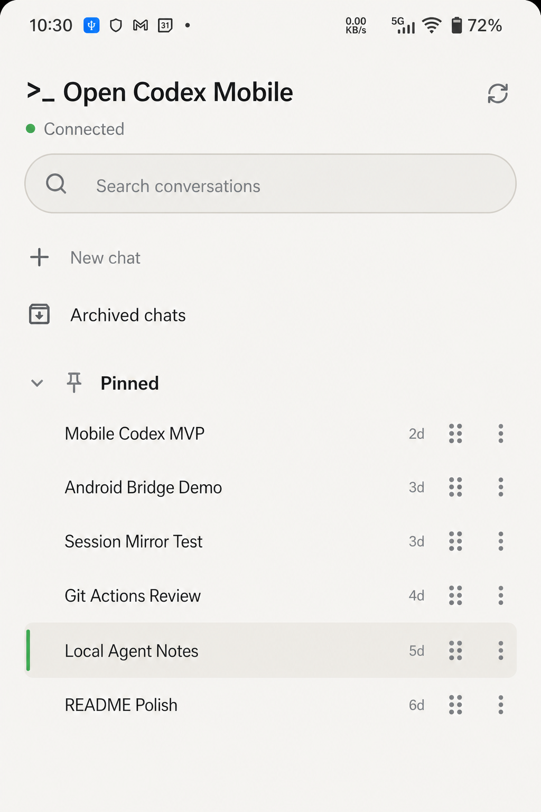
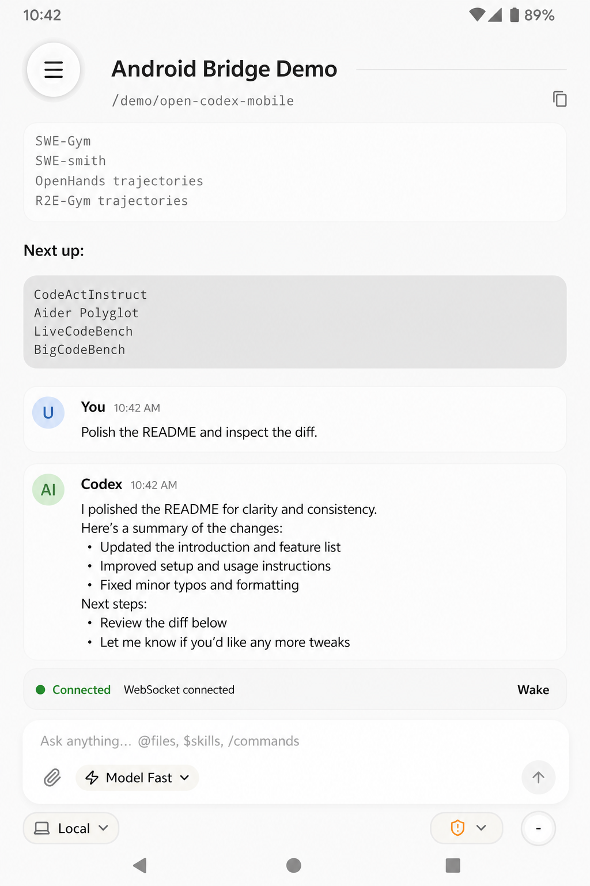

# Open Codex Mobile

<p align="center">
  
</p>

<p align="center">
  <strong>Android-first mobile remote control for your local Codex sessions.</strong>
</p>

<p align="center">
  🤖 <strong>Android App</strong> • 🖥️ Local Mac Bridge • 🔐 Relay Pairing • 🪞 Session Mirror
</p>

<p align="center">
  <a href="README.zh.md">中文文档</a> •
  <a href="#quick-navigation">Quick Navigation</a> •
  <a href="#features">Features</a> •
  <a href="#workflow">Workflow</a> •
  <a href="#roadmap">Roadmap</a> •
  <a href="#acknowledgements">Acknowledgements</a>
</p>

<p align="center">
  
  
  
  
</p>

> [!IMPORTANT]
> **Open Codex Mobile is an experimental Android-first mobile control layer, not a hosted AI agent service.**
>
> 📱 The phone is the controller. 🖥️ Your Mac remains the executor. The bridge talks to the local `codex app-server`, mirrors local Codex threads, and forwards mobile messages back to the desktop runtime.
>
> Model availability, provider behavior, sandbox behavior, and fast-mode behavior are still decided by your desktop Codex configuration. The mobile UI cannot unlock models or service tiers that your local provider does not support.

## Quick Navigation

> [!TIP]
> **For users** -> pair your phone with your Mac once, then monitor and continue local Codex sessions from mobile. 📲
>
> **For builders** -> the product loop is `Codex session files -> bridge -> encrypted relay channel -> Android UI -> turn/start back to Codex`. 🧩

## Screenshots

<p align="center">
  
  
</p>

## Features

- 🪞 **Mobile session mirror**: list local Codex sessions, open conversations, and hydrate recent history from local JSONL when `thread/read` is slow or incomplete.
- ✍️ **Remote turn sending**: send follow-up messages from the phone into the selected desktop Codex thread.
- 🔁 **Trusted reconnect**: keep a trusted phone paired across bridge restarts until pairing is reset.
- 📌 **Pinned session support**: mirror pinned thread state and expose mobile pin/unpin flows.
- 🌐 **Relay-friendly networking**: both Mac and phone connect outward, so the phone does not need to be on the same LAN as the Mac.
- 🎛️ **Runtime controls**: expose model, reasoning, access mode, and fast-mode controls while still respecting the local desktop Codex provider.

## Workflow

| Stage | What happens | Why it matters |
| --- | --- | --- |
| 🤝 Pair | The Mac bridge creates a QR payload or short pairing code. | The phone learns how to reach this Mac through the relay. |
| 🪞 Mirror | The bridge reads local Codex threads and streams updates to Android. | Mobile sees the desktop session list and conversation state. |
| 📜 Hydrate | Large or slow threads fall back to local JSONL history parsing. | Old/heavy sessions can still show recent messages. |
| 🚀 Send | Android sends a user turn through the bridge into `codex app-server`. | The Mac continues to execute the work locally. |
| 🔁 Reconnect | Trusted phones reuse saved pairing state after temporary disconnects. | Daily mobile use does not require rescanning every time. |

## Android Scope

Open Codex Mobile is currently an **Android-oriented release**. 🤖 The primary client in this repository is the native Kotlin/Compose **Android app** under `android/`; other desktop, bridge, shared, and relay pieces exist to support that **Android workflow**.

## Safety Model

Open Codex Mobile is designed around a local-first boundary:

- 🔑 The bridge does not store OpenAI or custom provider API keys.
- 🧹 Pairing state is local machine state and should not be committed.
- 🔐 Live relay `sessionId`, pairing codes, identity keys, logs, and device state should be treated as bearer-like secrets.
- 🖥️ The phone can request work, but the desktop Codex runtime and its sandbox/provider settings decide what actually runs.
- 🎛️ Unsupported mobile model or fast-mode selections should be treated as desktop-provider no-ops or errors, not mobile-side capability.

## Quick Start

### 1. Start the Mac bridge

```sh
cd phodex-bridge
npm install
npm start
```

Optional relay override:

```sh
REMODEX_RELAY=wss://your-relay.example.com/relay npm start
```

### 2. Install the Android app

```sh
cd android
./gradlew :app:installDebug
```

### 3. Pair your phone

Open the Android app, scan the bridge QR code, or enter the short pairing code.

After the first successful pairing, trusted reconnect should keep the phone connected across normal bridge restarts until you explicitly reset pairing.

## Repository Layout

```text
android/         Android app source
phodex-bridge/  Node.js bridge that talks to local codex app-server
relay/          Minimal relay server for outbound Mac/phone connections
remodex-host/   Desktop/web host experiments
shared/         Shared protocol/model helpers
Docs/           Design notes and implementation recaps
```

## Runtime Notes

- 🤖 `GPT-5.5` is the safest default when your local desktop provider is configured for it.
- 🧩 Other model choices only work if `model/list` from your desktop Codex runtime exposes them and your provider accepts them.
- ⚡ Fast mode is forwarded as `serviceTier: "fast"` where supported, but custom providers may ignore it.
- 🛡️ Access mode is forwarded to the desktop runtime, but final behavior depends on the Codex app-server version and sandbox compatibility.

## Roadmap

- 🎨 Cleaner open-source branding and package naming.
- 🤖 Provider-aware model picker that hides unavailable desktop models.
- ⚡ Clearer fast-mode UI when the desktop provider may ignore service tiers.
- 📌 Stronger bidirectional pinned ordering sync.
- 📦 More deterministic release builds and APK packaging.
- 🔐 Self-hosted relay documentation and hardening.

## Acknowledgements

🙏 Open Codex Mobile is based on the [Remodex](https://github.com/Stivy-01/remodex) mobile/bridge work. Thanks to the [Remodex](https://github.com/Stivy-01/remodex) authors and contributors for the original **Android** client, bridge, relay, and mobile Codex control ideas.

This repository is an OpenCodexLabs adaptation focused on an **Android-first** open-source release: clearer **Android** build flow, OpenCodexLabs branding, and local Codex session workflows tuned for **Android phones**.

## Related

- 🙏 Derived from the [Remodex](https://github.com/Stivy-01/remodex) mobile/bridge architecture.
- 🤖 Adapted by OpenCodexLabs as an **Android-first** experiment around phone-controlled local Codex sessions.

## License

[Apache-2.0](LICENSE)
