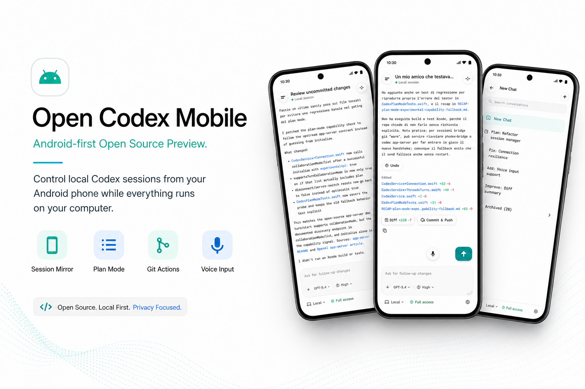

# Open Codex Mobile

<p align="center">
  
</p>

<p align="center">
  <strong>面向 Android 的本地 Codex session 手机远程控制版本。</strong>
</p>

<p align="center">
  • Android App • 本地 Mac Bridge • Relay 配对 • Session Mirror •
</p>

<p align="center">
  <a href="README.md">English</a> •
  <a href="#快速导航">快速导航</a> •
  <a href="#功能">功能</a> •
  <a href="#工作流">工作流</a> •
  <a href="#路线图">路线图</a>
</p>

<p align="center">
  
  
  
  
</p>

> [!IMPORTANT]
> **Open Codex Mobile 是实验性的移动端控制层，不是托管式 AI Agent 服务。**
>
> 手机只是控制端。真正执行任务的仍然是你的 Mac。Bridge 会连接本地 `codex app-server`，同步本地 Codex thread，并把手机上的输入转发回桌面 Codex runtime。
>
> 模型、provider、权限、sandbox、fast mode 是否真正生效，都由电脑端 Codex 配置决定。手机 UI 不能解锁电脑 provider 不支持的模型或加速模式。

## 快速导航

> [!TIP]
> **给使用者** -> 手机和 Mac 配对一次后，就可以在手机上查看、监督和继续本地 Codex session。
>
> **给开发者** -> 核心链路是 `Codex session files -> bridge -> encrypted relay channel -> Android UI -> turn/start back to Codex`。

## 功能

- **移动端 session mirror**：读取本地 Codex session 列表，打开对话，并展示 conversation history。
- **手机继续对话**：在手机上发送消息，Bridge 会转发到电脑端 `codex app-server` 继续同一个 thread。
- **大 session 兜底读取**：当 `thread/read` 对超大 JSONL 变慢或为空时，Bridge 会从本地 JSONL 解析最近历史。
- **可信重连**：首次配对后，可信手机可以跨 Bridge 重启继续连接，直到手动 reset pairing。
- **置顶 session 支持**：同步和操作 pinned thread 状态。
- **非同网远程访问**：Mac 和手机都主动连 relay，不要求手机和电脑在同一个局域网。
- **运行参数控制**：暴露 model、reasoning、access mode、fast mode，但最终仍以电脑端 provider 支持为准。

## 工作流

| 阶段 | 发生什么 | 为什么重要 |
| --- | --- | --- |
| 配对 | Mac Bridge 生成 QR 或短 pairing code。 | 手机获得连接这台 Mac 的 relay 信息。 |
| 同步 | Bridge 读取本地 Codex threads 并推送给 Android。 | 手机能看到电脑端 session 列表和对话状态。 |
| 历史读取 | 大 session 会 fallback 到本地 JSONL recent history。 | 老对话或超长对话也能显示最近消息。 |
| 发送 | Android 把用户输入经 Bridge 发到 `codex app-server`。 | 真正执行仍发生在电脑。 |
| 重连 | 可信手机复用保存的配对状态。 | 日常使用不需要每次重新扫码。 |

## Android 范围

Open Codex Mobile 当前是 Android-oriented release。这个仓库里的主要客户端是 `android/` 下的 Kotlin/Compose 原生 Android App；desktop、bridge、shared、relay 等模块主要是为了支撑 Android 远程控制本地 Codex session 的工作流。

## 安全边界

Open Codex Mobile 默认按 local-first 边界设计：

- Bridge 不保存 OpenAI 或自定义 provider API key。
- pairing state 是本机状态，不应该提交到仓库。
- live relay `sessionId`、pairing code、identity key、日志和 device state 都应视作敏感信息。
- 手机可以发起工作，但能跑什么由电脑端 Codex runtime 和 sandbox/provider 决定。
- 手机上不支持的模型或 fast mode 选择，应该视为 provider no-op 或电脑端报错，而不是手机端能力。

## 快速开始

### 1. 启动 Mac Bridge

```sh
cd phodex-bridge
npm install
npm start
```

如果要指定自己的 relay：

```sh
REMODEX_RELAY=wss://your-relay.example.com/relay npm start
```

### 2. 安装 Android App

```sh
cd android
./gradlew :app:installDebug
```

### 3. 手机配对

打开 Android app，扫码 Bridge 打印的 QR，或输入短 pairing code。

首次配对成功后，正常情况下可信重连会持续生效，直到你手动 reset pairing。

## 仓库结构

```text
android/         Android app 源码
phodex-bridge/  连接本地 codex app-server 的 Node.js bridge
relay/          Mac/手机 outbound 连接用的最小 relay
remodex-host/   桌面/web host 实验
shared/         共享 protocol/model helper
Docs/           设计和实现记录
```

## 运行备注

- 如果你的电脑端 provider 主要支持 `GPT-5.5`，手机端就应该默认使用 `GPT-5.5`。
- 其它模型只有在电脑端 `model/list` 返回且 provider 接受时才会生效。
- Fast mode 会尽量以 `serviceTier: "fast"` 传给桌面端，但自定义 provider 可能忽略。
- 权限模式会传给桌面 runtime，但具体行为依赖 Codex app-server 版本和 sandbox 兼容性。

## 路线图

- 更干净的 open-source branding 和 package naming。
- provider-aware 模型选择器，隐藏电脑端不可用模型。
- 当 provider 可能忽略 fast mode 时，给出更明确的 UI 提示。
- 更稳定的 pinned ordering 双向同步。
- 更确定性的 release build 和 APK 分发。
- self-hosted relay 文档和安全加固。

## 相关

- 基于 Remodex mobile/bridge 架构继续实验。
- OpenCodexLabs 关于“手机控制本地 Codex session”的开源探索。

## License

[Apache-2.0](LICENSE)
